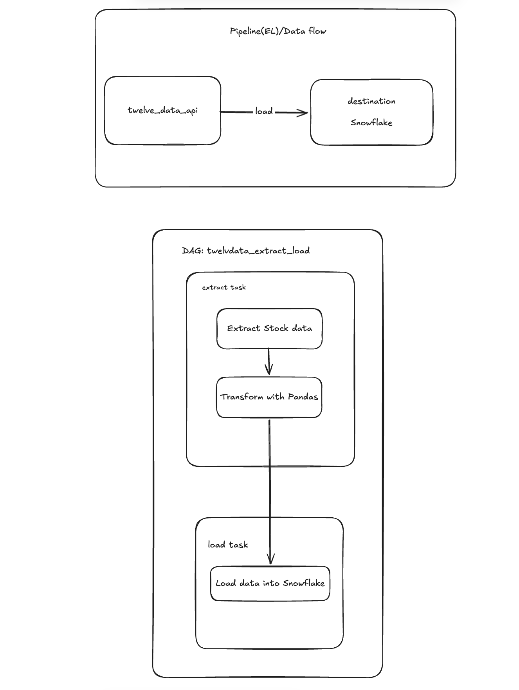

# Twelve Data ETL Pipeline

## Project Title

**Twelve Data ETL Pipeline** - Python ETL pipeline that extracts stock market data from the Twelve Data API, transforms it using Pandas, and loads it into Snowflake with Apache Airflow orchestration.

---

## Project Overview

This project is an ETL pipeline that fetches financial market data from the Twelve Data API and loads it into Snowflake.

The pipeline extracts daily stock time-series data for multiple symbols. It handles API request limits using batch processing and concurrency, transforms the API response into a Pandas DataFrame, and loads the resulting data into Snowflake.

**Schema drift handling:** before each load, the pipeline compares the DataFrame columns with the existing Snowflake table and automatically adds any missing columns using `ALTER TABLE ... ADD COLUMN`. The Snowflake data type is chosen from the Pandas dtype, so new fields in the source data do not break the load.

**Loading strategy:** the data is loaded with an append strategy using `write_pandas`. The destination table is created automatically on the first run, and later runs append new rows without overwriting existing data. A merge (upsert) option is also available in the Snowflake utility for idempotent loads.

Apache Airflow is used to orchestrate the extraction and loading process.

---


## Project Architecture / Data Flow

**Pipeline:** Extract stock data from Twelve Data API → Handle API rate limits → Transform API response using Pandas → Load data into Snowflake

**Airflow Workflow:** Extract → Load



---

## Technology Stack

| **Component**             | **Technology**                                               |
| ------------------------- | ------------------------------------------------------------ |
| **Language**              | Python 3.12+                                                 |
| **Package Manager**       | UV                                                           |
| **Data Processing**       | Pandas                                                       |
| **API Requests**          | Requests                                                     |
| **Data Source**           | Twelve Data API                                              |
| **Data Warehouse**        | Snowflake                                                    |
| **Database Connection**   | Airflow SnowflakeHook                                        |
| **Orchestration**         | Apache Airflow                                               |
| **Concurrency**           | ThreadPoolExecutor                                           |
| **Environment Variables** | python-dotenv                                                |
| **Containerization**      | Docker                                                       |
| **Testing**               | Pytest                                                       |

---

## Source Data

**Data Source:** Twelve Data API

The pipeline uses the Twelve Data `time_series` endpoint to retrieve daily stock market data.

[twelve_data_api_documentation](https://twelvedata.com/docs/introduction/overview)


---


### Database Operations

The Snowflake utility (`include/utilities/utils_snowflake.py`) handles:

* Creating and closing a Snowflake connection
* Checking whether the destination table exists
* Detecting schema drift and adding missing columns automatically
* Loading Pandas DataFrames (append) and merging them (upsert)
* Validating database/schema/table identifiers before they are used in SQL

---

## Apache Airflow

Apache Airflow is used to orchestrate the ETL pipeline.


## Error Handling

The pipeline includes error handling for API and data extraction failures.

### HTTP Errors

HTTP request failures are handled using `requests.RequestException`.

### API Errors

The pipeline checks the API response for an error status even when the HTTP request itself succeeds.

### Missing Data

The pipeline checks whether expected fields such as `meta` and `values` exist in the API response.

### Failed Symbols

If an individual stock symbol fails, the pipeline continues processing the other symbols.

If all requests fail, the pipeline raises an error indicating that no data was successfully extracted.

---

## Prerequisites
**Required Software:**

* Python
* UV
* Docker
* Apache Airflow
* Snowflake account

**Required External Access:**

* Twelve Data API key
* Snowflake account with network access

### Environment Variables

Create a `.env` file in the project root containing the Twelve Data API key.

```text
API_KEY=your_api_key
```


---

## Installation & Setup

### Step 1: Clone the Repository

```bash
git clone https://github.com/ukhatri007/twelvedata_etl.git

cd twelvedata_etl
```

### Step 2: Install Dependencies

Use UV to install the dependencies defined in `pyproject.toml`.

```bash
uv sync
```

### Step 3: Create `.env`

Create a `.env` file in the project root and add your Twelve Data API key.

### Step 4: Activate the Environment

```bash
source .venv/bin/activate
```

### Step 5: Run the ETL Pipeline

The ETL pipeline can be executed directly using:

```bash
python pipelines/etl_twelvedata.py
```

### Step 6: Run with Airflow

Start Airflow and load the DAG located at:

```text
dags/twelve_data.py
```

Trigger the `twelvedata_extract_load` DAG from the Airflow interface.

---

## What I Learned

* **Data Engineering Concepts** - ETL pipeline design, batch processing, API ingestion, rate-limit handling.
* **API Integration** - REST API requests, API response handling, error handling, and request limitations.
* **Python Development** - Pandas, concurrency, exception handling, environment variables, and modular code organization.
* **Data Processing** - Converting API responses into DataFrames and combining data from multiple sources.
* **Snowflake** - Connecting Python applications to Snowflake, loading Pandas DataFrames, and handling schema drift.
* **Apache Airflow** - DAG creation, task dependencies, pipeline orchestration, and task execution.
* **Concurrency** - Using `ThreadPoolExecutor` to process multiple API requests concurrently.
* **Development Tools** - UV, Docker and Git.

---

## Future plan that I will work on

* **Incremental Loading** - Load only new or changed market data instead of repeatedly processing the same data.
* **Data Quality** - Add stronger validation and automated data-quality checks.
* **Orchestration** - Add a production-oriented Airflow schedule and retry configuration.
* **Data Modeling** - Create staging and analytical models for downstream financial analysis.
* **CI/CD** - Add GitHub Actions for automated testing and code quality checks.
* **Containerization** - Improve Docker-based deployment for production environments.
* **Analytics** - Build dashboards using the loaded Snowflake data.

---

## Contact

**Feel free to reach me if you have any questions.**

* **LinkedIn:** [Ujjwol K.C.](https://www.linkedin.com/in/ujjwol-k-c-37519329b/)
* **Email:** [kcujjwol1999@gmail.com](mailto:kcujjwol1999@gmail.com)
* **GitHub:** [ukhatri007](https://github.com/ukhatri007)